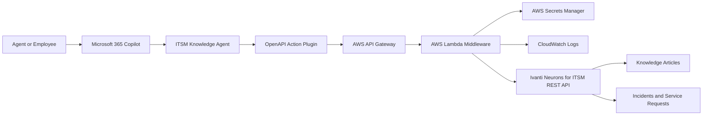

# Ivanti Copilot

Architecture scaffold for an Ivanti Neurons for ITSM knowledge-retention assistant using Microsoft 365 Copilot extensibility and AWS-hosted middleware.

## What This App Does

The app gives IT agents a Copilot-accessible way to ask natural-language questions against Ivanti knowledge articles, related incidents, and future knowledge drafts while keeping Ivanti as the system of record.

Core capabilities:

- Search approved Ivanti knowledge articles from Copilot.
- Retrieve specific source articles with links and metadata.
- Find similar resolved incidents for ticket-context support.
- Keep all Ivanti credentials in AWS, never in Copilot manifests.
- Return cited, bounded answers instead of uncited generated guidance.

## Architecture



Recommended Microsoft path:

- Use Microsoft 365 Copilot connectors for indexed KB grounding when licensing allows it.
- Use a Copilot declarative agent with OpenAPI actions for live Ivanti lookups.
- Use Copilot Studio only where low-code publishing/governance is preferred.

Recommended AWS path:

- API Gateway exposes a small, authenticated REST surface.
- Lambda handles validation, Ivanti REST calls, response shaping, and audit logging.
- Secrets Manager stores Ivanti API credentials.
- CloudWatch captures operational logs and correlation IDs.

## Repo Layout

```text
api/                         OpenAPI contract consumed by Copilot actions
backend/                     AWS Lambda middleware skeleton
config/                      Environment variable examples
copilot/                     Agent instructions and publishing notes
docs/                        Architecture, security, and rollout details
infra/                       AWS CDK scaffold
```

## First Decisions To Confirm

- Microsoft licensing: Microsoft 365 Copilot add-on, Copilot Studio, or pay-as-you-go.
- Ivanti tenant URL and REST auth method.
- Ivanti business object names for knowledge articles and incidents.
- Whether KB content should be synced into Microsoft Graph, queried live, or both.
- Initial audience: IT agents only, or broader employee self-service.

## Local Development Shape

The backend skeleton is intentionally dependency-light. It uses Node.js `fetch`, environment variables, and a single Lambda handler.

```powershell
cd B:\Ivanti-copilot\backend
copy ..\config\example.env .env
npm install
npm run typecheck
npm test
```

The CDK scaffold under `infra/cdk` is a starting point for AWS deployment and should be wired to your preferred AWS account/bootstrap pattern before deployment.

## Running in Docker

The same handler runs as a container via a small HTTP adapter (`backend/src/server.ts`), so it can be deployed to ECS/Fargate, Kubernetes, or run locally.

```powershell
cd B:\Ivanti-copilot\backend
docker build -t ivanti-copilot .
docker run --rm -p 8080:8080 --env-file .env ivanti-copilot
# GET http://localhost:8080/health
```

In a container, inject credentials as environment variables (`IVANTI_AUTH_HEADER_VALUE`, optionally `INTERNAL_SHARED_SECRET`). On AWS Lambda, leave those unset and the handler reads them from Secrets Manager via `IVANTI_SECRET_ARN`.

## License

Licensed under the Apache License 2.0. See [LICENSE](LICENSE) and [NOTICE](NOTICE).

This is an independent integration scaffold and is not affiliated with or endorsed by Ivanti, Inc. or Microsoft Corporation. Product names referenced here are trademarks of their respective owners.

