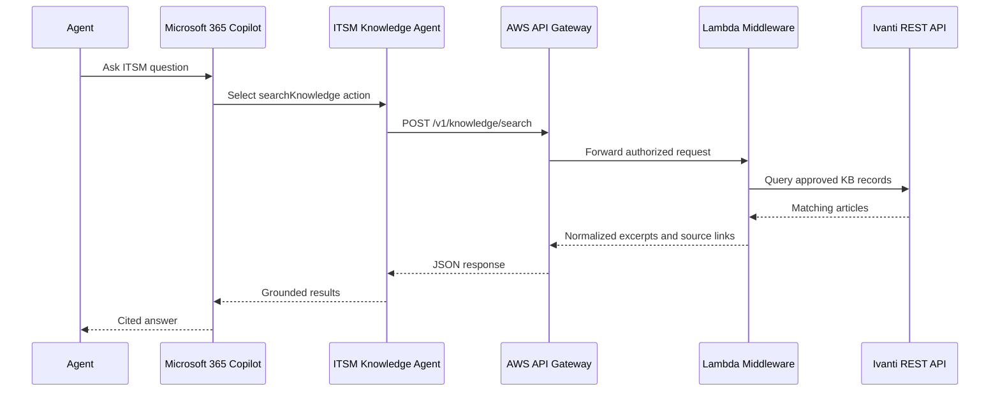
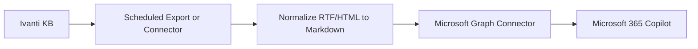

# Architecture

## Goal

Create an enterprise knowledge-retention assistant that lets Microsoft 365 Copilot retrieve Ivanti Neurons for ITSM knowledge and ticket context with citations, auditability, and permission boundaries.

## Design Principles

- Ivanti remains the system of record.
- Copilot receives only bounded retrieval results, not raw unrestricted ITSM data.
- Every answer path should preserve source article IDs, titles, timestamps, and direct Ivanti links.
- AWS owns the integration security boundary.
- Tenant-specific Ivanti object names and field mappings stay configurable.
- Human approval is required before any knowledge article is created or updated.

## Logical Components

### Microsoft 365 Copilot Surface

Primary user experience for agents and, later, employee self-service.

Recommended shape:

- A declarative agent named `ITSM Knowledge Agent`.
- Custom instructions that require citations and forbid unsupported procedural advice.
- OpenAPI actions that call the AWS middleware for live Ivanti lookup.
- Optional Microsoft Graph connector for indexed KB grounding if licensing and governance allow it.

### AWS Middleware

An integration layer that sits between Copilot and Ivanti.

Responsibilities:

- Authenticate and authorize incoming requests.
- Normalize Copilot action requests.
- Call Ivanti REST APIs using service credentials stored in AWS.
- Shape responses into concise, citation-ready payloads.
- Log correlation IDs, caller context, endpoint, latency, and result counts.
- Enforce allowlists for actions and returned fields.

Recommended services:

- Amazon API Gateway
- AWS Lambda
- AWS Secrets Manager
- Amazon CloudWatch Logs
- AWS WAF for public endpoints
- Optional Amazon OpenSearch Serverless or Amazon Kendra for internal semantic indexing

### Ivanti Neurons for ITSM

Source of truth for:

- Knowledge articles
- Incident records
- Service request records
- Resolution notes
- Article ownership and review metadata

The initial integration should be read-only.

## Data Flow: Live Knowledge Search

## Data Flow: Indexed Knowledge Grounding

Use this path when Microsoft licensing and data-governance approvals support connector indexing.

## API Surface

Initial read-only endpoints:

- `GET /health`
- `POST /v1/knowledge/search`
- `GET /v1/knowledge/articles/{articleId}`
- `POST /v1/incidents/similar`

Future endpoints:

- `POST /v1/knowledge/drafts`
- `POST /v1/tickets/{ticketId}/suggest-articles`
- `POST /v1/knowledge/gaps/analyze`

## Permission Model

Phase 1 can use a restricted service account that only sees approved IT knowledge records.

Later phases should add:

- Entra ID caller identity propagation.
- API Gateway JWT authorizer.
- Group-based endpoint allowlists.
- Ivanti role-aware filtering where API support allows it.

## Deployment Environments

Recommended environments:

- `dev`: internal technical testing with non-production Ivanti tenant or restricted object set.
- `pilot`: production tenant, IT-agent-only, limited KB categories.
- `prod`: governed rollout with monitoring, support runbooks, and change controls.

## Key Open Questions

- Exact Ivanti object names and field names for knowledge articles and incidents.
- Whether Ivanti article visibility can be enforced at API query time for each caller.
- Microsoft 365 Copilot and Copilot Studio license entitlements.
- Whether Graph connector indexing is acceptable for internal KB content.
- Whether AWS should be public with Entra-protected API Gateway or private behind an enterprise network path.

